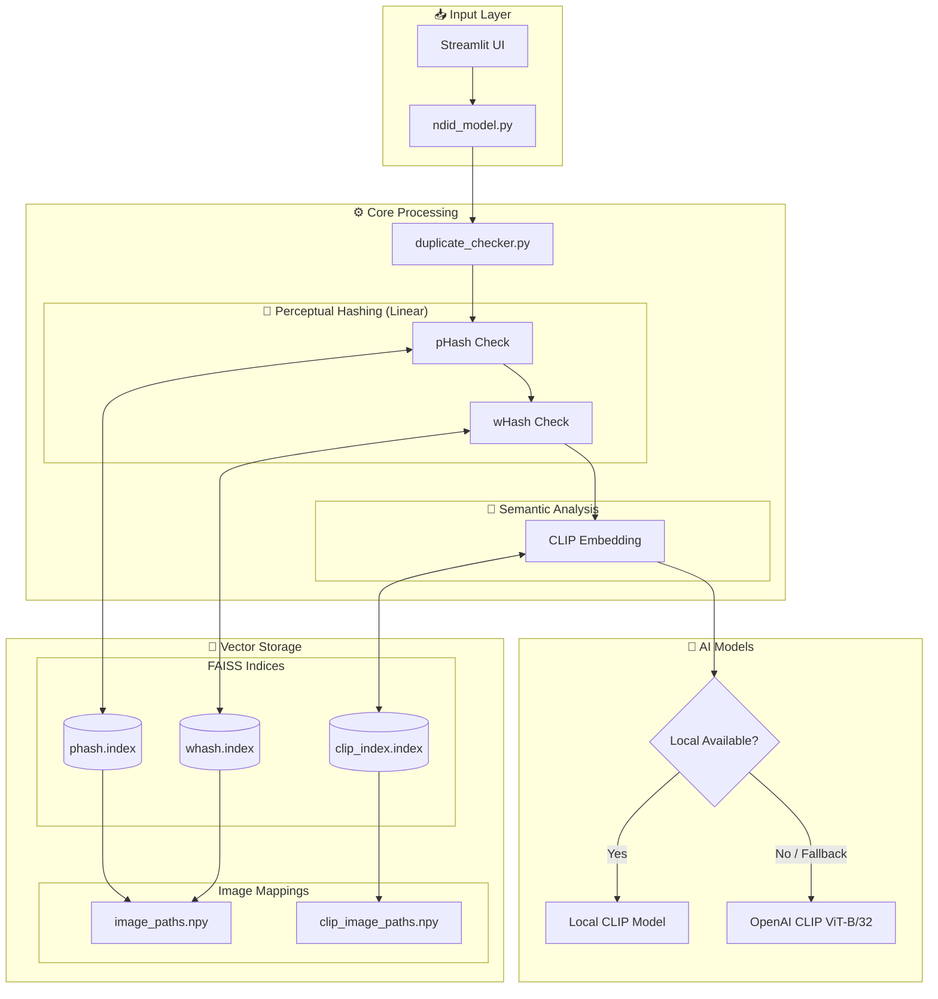
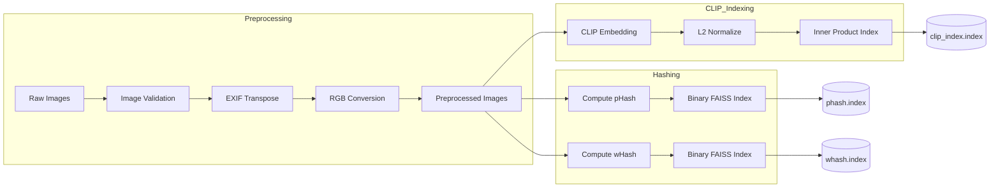
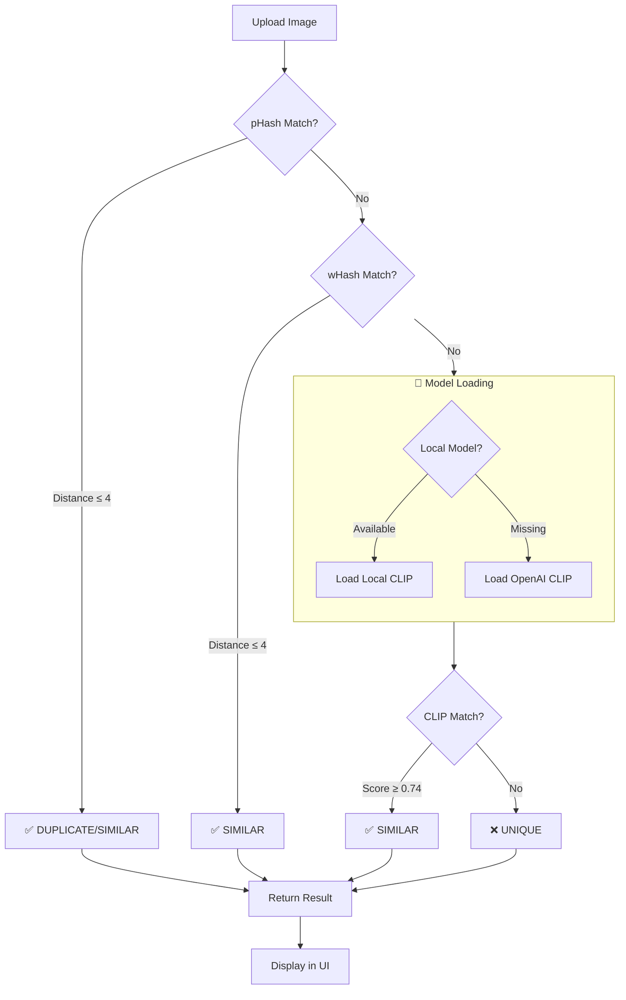

<p align="center">
  
  
  
  
</p>

# 🔮 DejaView — Near-Duplicate Image Detection (NDID)

> *"Maya represents the veil of illusion where one truth can take a thousand different forms."*

**DejaView** is a high-performance Near-Duplicate Image Detection system that acts like the **Sudarshana Chakra**—a tool of ultimate discernment that cuts through the illusions of editing and compression to identify the original "soul" (the source image) within a vast sea of data.

---

## 📋 Table of Contents

- [Problem Statement](#-problem-statement)
- [Solution Overview](#-solution-overview)
- [System Architecture](#-system-architecture)
- [Pipeline Workflow](#-pipeline-workflow)
- [Project Structure](#-project-structure)
- [Installation](#-installation)
- [Usage](#-usage)
- [Technical Details](#-technical-details)
- [Evaluation Metrics](#-evaluation-metrics)
- [Datasets](#-datasets)

---

## 🎯 Problem Statement

In modern digital platforms such as **social media**, **e-commerce**, **content hosting**, and **news aggregation systems**, millions of images are uploaded every day. A significant portion of these uploads are **duplicate or near-duplicate images**—the same image uploaded multiple times or slightly modified versions of an existing image.

### Challenges

Traditional systems struggle to automatically detect these duplicates when images are:

| Transformation | Description |
|----------------|-------------|
| 🔄 **Resized** | Scaled up or down |
| ✂️ **Cropped** | Portions removed |
| 📦 **Compressed** | Quality reduced (JPEG artifacts) |
| 🎨 **Color-adjusted** | Brightness, contrast, saturation changes |
| 💧 **Watermarked** | Text or logos overlaid |
| 🖼️ **Slightly edited** | Minor retouching or filters |

### 🖼️ Transformation Examples

DejaView can detect duplicates across all these transformations:

#### 🔄 Resized (Scaled up or down)
| Original | Detection |
|:--------:|:---------:|
|  | ✅ Detected |

---

#### ✂️ Cropped (Portions removed)
| Original | Detection |
|:--------:|:---------:|
|  | ✅ Detected |


---

#### 📦 Compressed (Quality reduced - JPEG artifacts)
| Original | Detection |
|:--------:|:---------:|
|  | ✅ Detected |


---

#### 🎨 Color-adjusted (Brightness, contrast, saturation changes)
| Original | Detection |
|:--------:|:---------:|
| | ✅ Detected |


---

#### 💧 Watermarked (Text or logos overlaid)
| Original | Detection |
|:--------:|:---------:|
|  | ✅ Detected |


---

#### 🖼️ Slightly edited (Minor retouching or filters)
| Original | Detection |
|:--------:|:---------:|
|  | ✅ Detected |

---

### Why It Matters

| Use Case | Benefit |
|----------|---------|
| **Storage Optimization** | Eliminating redundant copies to save petabytes of cloud storage |
| **Spam & Integrity** | Preventing "repost bots" from flooding feeds and protecting original creators from copyright infringement |
| **Search Relevance** | Ensuring a news aggregator doesn't show the same thumbnail ten times for one story |

---

## 💡 Solution Overview

DejaView implements a **multi-layered detection pipeline** that combines:

1. **Perceptual Hashing (pHash)** — Fast structural fingerprinting
2. **Wavelet Hashing (wHash)** — Frequency-domain analysis for robustness
3. **CLIP Embeddings** — Deep semantic understanding via vision transformers

```
┌─────────────────────────────────────────────────────────────────┐
│                        DejaView Pipeline                        │
├─────────────────────────────────────────────────────────────────┤
│                                                                 │
│   Input Image ──► pHash Check ──► wHash Check ──► CLIP Check    │
│                        │              │              │          │
│                        ▼              ▼              ▼          │
│                   [Duplicate]    [Similar]      [Similar]       │
│                    (Fast)        (Medium)       (Semantic)      │
│                                                                 │
└─────────────────────────────────────────────────────────────────┘
```

---

## 🏗️ System Architecture



---

## 🔄 Pipeline Workflow

### Phase 1: Preprocessing & Indexing (Offline)



### Phase 2: Query & Detection (Online)



---

## 📁 Project Structure

```
DejaView/
│
├── 📄 streamlitUI.py          # Web interface for image upload & results
├── 📄 ndid_model.py           # Bridge between UI and detection pipeline
├── 📄 duplicate_checker.py    # Core detection logic with 3-stage pipeline
│
├── 📄 Final_preprocessing_hashing.py  # Image preprocessing & hash generation
├── 📄 Faiss_implementation.py         # FAISS index creation for hashes
├── 📄 clip_train.py                   # CLIP embedding & indexing
├── 📄 download_model.py               # Download CLIP model for local use
│
├── 📄 phash.index             # FAISS binary index for perceptual hashes
├── 📄 whash.index             # FAISS binary index for wavelet hashes
├── 📄 image_paths.npy         # Image path mappings for hash indices
│
├── 📂 CLIP/
│   ├── clip_index.index       # FAISS index for CLIP embeddings
│   ├── clip_image_paths.npy   # Image path mappings for CLIP
│   └── clip_embeddings.npy    # Stored CLIP embeddings
│
├── 📂 local_clip_model/       # Cached CLIP model (ViT-B/32)
├── 📂 images/                 # Dataset images
│
└── 📄 requirements.txt        # Python dependencies
```

### Module Descriptions

| Module | Purpose |
|--------|---------|
| `streamlitUI.py` | Interactive web UI for uploading images and viewing detection results |
| `ndid_model.py` | Handles file upload, creates temp files, and invokes the detection pipeline |
| `duplicate_checker.py` | Main orchestrator: loads indices, runs 3-stage detection (pHash → wHash → CLIP) |
| `Final_preprocessing_hashing.py` | Image preprocessing (EXIF, RGB) and perceptual/wavelet hash computation |
| `Faiss_implementation.py` | Builds FAISS binary indices from hash values |
| `clip_train.py` | Generates CLIP embeddings and builds semantic search index |
| `download_model.py` | Downloads and caches OpenAI CLIP model locally |

---

## 🛠️ Installation

### Prerequisites

- Python 3.8+
- pip or conda

### Steps

```bash
# 1. Clone the repository
git clone https://github.com/your-username/DejaView.git
cd DejaView

# 2. Create virtual environment (recommended)
python -m venv venv
source venv/bin/activate  # Linux/Mac
# or
.\venv\Scripts\activate   # Windows

# 3. Install dependencies
pip install -r requirements.txt

# 4. Download CLIP model (one-time)
python download_model.py
```

### Dependencies

```
imagehash        # Perceptual & wavelet hashing
faiss-cpu        # Vector similarity search
numpy            # Numerical operations
Pillow           # Image processing
transformers     # CLIP model loading
torch            # Deep learning backend
streamlit        # Web UI framework
```

---

## 🚀 Usage

### Running the Web Interface

```bash
streamlit run streamlitUI.py
```

This will launch a local web server (typically at `http://localhost:8501`) where you can:

1. **Upload an image** (JPG, PNG, BMP supported)
2. **Click "Run NDID"** to analyze
3. **View results**: Status, similarity percentage, method used, and matched image

### Programmatic Usage

```python
from duplicate_checker import check_image_pipeline

result = check_image_pipeline("path/to/your/image.jpg")

print(result)
# {
#     "status": "Similar",           # Unique | Similar | Duplicate
#     "similarity_percentage": 87.5,
#     "matched_image_path": "/path/to/matched_image.png",
#     "source_image_path": "path/to/your/image.jpg",
#     "method": "clip"               # phash | whash | clip
# }
```

---

## 🔬 Technical Details

### Detection Thresholds

| Method | Threshold | Metric | Description |
|--------|-----------|--------|-------------|
| **pHash** | ≤ 4 bits | Hamming Distance | 64-bit hash, max 4 bit difference |
| **wHash** | ≤ 4 bits | Hamming Distance | 64-bit hash, max 4 bit difference |
| **CLIP** | ≥ 0.74 | Cosine Similarity | 512-dim embeddings, inner product |

### Why This Order?

```
pHash (Fastest)  →  wHash (Fast)  →  CLIP (Slowest but Smartest)
     │                  │                    │
     ▼                  ▼                    ▼
 ~0.1ms/img         ~0.2ms/img           ~50ms/img
```

1. **pHash first**: Catches exact/near-exact duplicates instantly
2. **wHash second**: Catches slight geometric transformations
3. **CLIP last**: Semantic understanding for edited/filtered images

### CLIP Model

- **Architecture**: ViT-B/32 (Vision Transformer, patch size 32)
- **Embedding Dimension**: 512
- **Source**: OpenAI CLIP via HuggingFace Transformers
- **Local Caching**: Model cached in `local_clip_model/` for offline use

### FAISS Index Types

| Index | Type | Use Case |
|-------|------|----------|
| `phash.index` | `IndexBinaryFlat` | Exact Hamming distance search |
| `whash.index` | `IndexBinaryFlat` | Exact Hamming distance search |
| `clip_index.index` | `IndexFlatIP` | Inner product (cosine) search |

---

## 📊 Evaluation Metrics

The system is evaluated using the **F1 Score**, which balances precision and recall:

```
F1 = 2 × (Precision × Recall) / (Precision + Recall)
```

| Metric | Definition |
|--------|------------|
| **Precision** | Of all detected duplicates, how many are actually duplicates? |
| **Recall** | Of all actual duplicates, how many did we detect? |
| **F1 Score** | Harmonic mean of precision and recall |

---

## 📚 Datasets

### Recommended Datasets

| Dataset | Description | Link |
|---------|-------------|------|
| **Google Landmarks V2** | 5M+ landmark images with near-duplicates | [GitHub](https://github.com/cvdfoundation/google-landmark) |
| **INRIA Copydays** | Benchmark for copy detection with distortions | [INRIA](https://thoth.inrialpes.fr/~jegou/data.php.html#copydays) |

---

## 🏛️ Architecture Summary

```
┌────────────────────────────────────────────────────────────────────────────┐
│                              DejaView System                               │
├────────────────────────────────────────────────────────────────────────────┤
│                                                                            │
│  ┌─────────────┐     ┌─────────────────────────────────────────────────┐  │
│  │   Frontend  │     │              Backend Pipeline                    │  │
│  │             │     │                                                  │  │
│  │  Streamlit  │────▶│  ┌─────────┐   ┌─────────┐   ┌───────────────┐  │  │
│  │     UI      │     │  │  pHash  │──▶│  wHash  │──▶│     CLIP      │  │  │
│  │             │     │  │  Check  │   │  Check  │   │  Embeddings   │  │  │
│  └─────────────┘     │  └────┬────┘   └────┬────┘   └───────┬───────┘  │  │
│                      │       │             │                │          │  │
│                      │       ▼             ▼                ▼          │  │
│                      │  ┌─────────────────────────────────────────┐    │  │
│                      │  │           FAISS Vector Store            │    │  │
│                      │  │  ┌─────────┐ ┌─────────┐ ┌───────────┐  │    │  │
│                      │  │  │ phash   │ │ whash   │ │   clip    │  │    │  │
│                      │  │  │ .index  │ │ .index  │ │  .index   │  │    │  │
│                      │  │  └─────────┘ └─────────┘ └───────────┘  │    │  │
│                      │  └─────────────────────────────────────────┘    │  │
│                      └─────────────────────────────────────────────────┘  │
│                                                                            │
└────────────────────────────────────────────────────────────────────────────┘
```

---

## 👥 Authors

Built with ❤️ as part of the NDID (Near-Duplicate Image Detection) project.

---

## 📜 License

This project is for educational purposes.

---

## 🎬 Project Demo

<p align="center">
  <a href="https://www.youtube.com/watch?v=YOUR_VIDEO_ID">
    
  </a>
</p>

▶️ **[Click here to watch the full project demonstration](https://www.youtube.com/watch?v=YOUR_VIDEO_ID)**

<!-- REPLACE YOUR_VIDEO_ID with your actual YouTube video ID -->

---

<p align="center">
  <i>"Through the veil of Maya, DejaView sees the truth."</i>
</p>
