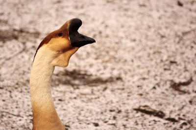
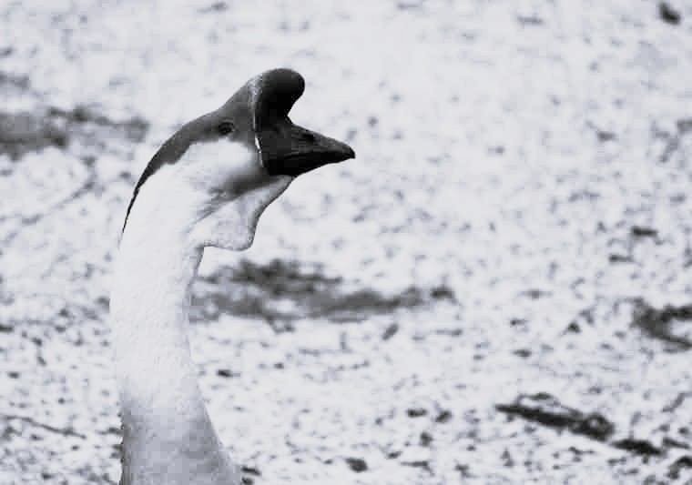
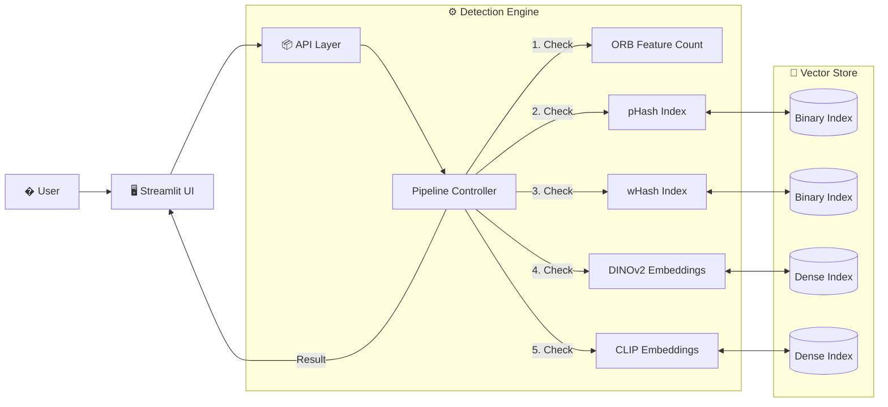

# 🔮 DejaView
### Near-Duplicate Image Detection System

<p align="center">
  
  
  
  
  
  
</p>

<p align="center">
  <i>"Maya represents the veil of illusion where one truth can take a thousand different forms."</i>
</p>

<p align="center">
  <b>DejaView</b> is a high-performance **Near-Duplicate Image Detection** system. It acts like the <b>Sudarshana Chakra</b>—cutting through the illusions of editing, compression, and manipulation to identify the original "soul" (the source image) within a vast sea of data.
</p>

---

## 🎨 Visual Capability Showcase

DejaView goes beyond simple exact matching. It detects images even when they are heavily modified.

| **✂️ Cropped** | **💧 Watermarked** | **🎨 Color Adjusted** |
|:---:|:---:|:---:|
|  |  |  |
| *Detects partial content* | *Ignores overlays & text* | *Robust to filters & shifts* |

| **📦 Compressed** | **🔄 Resized** | **🖼️ Edited/Mixed** |
|:---:|:---:|:---:|
|  |  |  |
| *Handling artifacts* | *Scale invariant* | *Semantic similarity* |

---

## � The Detection Pipeline

This system uses a **multi-stage funnel** to balance extreme speed with high accuracy.

```mermaid
graph TD
    subgraph Input
    I[📥 Incoming Image]
    end

    subgraph "Stage 1: Fast Filtering"
    I -->|Pre-check| S{🎯 Structure Check}
    S --"Too Few Features"--> R[🚫 REJECTED]
    S --"Valid"--> H{🔐 Hash Check}
    end

    subgraph "Stage 2: Semantic Analysis"
    H --"Exact/Near Match"--> M[✅ SIMILAR (Fast)]
    H --"No Match"--> D{🦕 DINOv2 Check}
    D --"High Similarity (>55%)"--> M2[✅ SIMILAR (Robust)]
    D --"Ambiguous (20-55%)"--> C{📎 CLIP Check}
    end
    
    subgraph "Stage 3: Fallback"
    C --"Confirmed"--> M3[✅ SIMILAR (Semantic)]
    C --"Low Score"--> U[❌ UNIQUE]
    D --"Low Complexity"--> U
    end

    style I fill:#f9f,stroke:#333
    style M fill:#bfb,stroke:#333
    style M2 fill:#bfb,stroke:#333
    style M3 fill:#bfb,stroke:#333
    style U fill:#fbb,stroke:#333
    style R fill:#ccc,stroke:#333
```

---

## 📋 Table of Contents

<details>
<summary><b>Click to expand</b></summary>

- [🎯 Problem Statement](#-problem-statement)
- [💡 Solution Overview](#-solution-overview)
- [🏗️ System Architecture](#️-system-architecture)
- [📁 Project Structure](#-project-structure)
- [🛠️ Installation](#️-installation)
- [🚀 Usage](#-usage)
- [🔬 Technical Details](#-technical-details)

</details>

---

## 🎯 Problem Statement

In the digital age, images are rarely unique. They are **resized**, **cropped**, **compressed**, and **edited**. 
Traditional hashing methods (MD5, SHA) fail instantly if a single pixel changes. 

**DejaView** solves this by using:
1.  **Perceptual Hashing (pHash)** for robust fingerprinting of visual structure.
2.  **Wavelet Hashing (wHash)** for frequency-domain comparison.
3.  **DINOv2 (Vision Transformer)** for understanding the *content* and *layout*, detecting objects even when cropped or shifted.
4.  **CLIP** for semantic backup when structural features are ambiguous.

---

## 🏗️ System Architecture



---

## 📁 Project Structure

```bash
DejaView/
├── 📂 src/                        # Source Code
│   ├── 📂 core/                   # 🧠 Brains (Pipeline, Index Management)
│   ├── 📂 models/                 # 🤖 Models (DINO, CLIP, Pooling)
│   ├── 📂 utils/                  # 🛠️ Tools (Hashing, FAISS, Verification)
│   └── � config.py               # ⚙️ Configuration
│
├── � assets/                     # 🎨 Images & Examples
│   └── � examples/               # (Used in this README)
│
├── 📂 scripts/                    # ⚡ Automation
│   ├── 📄 index_full_folder.py    # Batch Indexer
│   └── 📄 setup_models.py         # Model Downloader
│
├── 📂 web/                        # 🌐 Frontend
│   └── 📄 app.py                  # Streamlit App
│
├── 📂 data/                       # 💾 Database (Local)
│   ├── 📂 images/                 # Image Store
│   ├── 📂 indices/                # FAISS Indices
│   └── 📂 models/                 # Model Weights
│
└── 📄 run_dejaview.py             # 🚀 Entry Point
```

---

## 🛠️ Installation

1.  **Clone & Setup**
    ```bash
    git clone https://github.com/your-username/DejaView.git
    cd DejaView
    pip install -r requirements.txt
    ```

2.  **Download Models**
    ```bash
    python -m scripts.setup_models
    ```

---

## 🎬 Live Demo

See **DejaView** in action! Watch how it handles resizing, cropping, and edits in real-time.

<div align="center">
  <a href="https://www.youtube.com/watch?v=YOUR_VIDEO_ID_HERE">
    
  </a>
</div>

---

## 🚀 Usage

### 1. Start the UI
```bash
python run_dejaview.py
```
*Upload an image to see the pipeline in action.*

### 2. Batch Indexing
Index a folder of existing images to build your database:
```bash
python scripts/index_full_folder.py
```

---

## 🔬 Technical Deep Dive

### 🧠 GeM Pooling (Generalized Mean Pooling)
We rely on **GeM Pooling** for feature extraction. Unlike standard Global Average Pooling, GeM is a learnable parameter that focuses on "salient" features.

$$ \textbf{f} = \left( \frac{1}{|X|} \sum_{x \in X} x^p \right)^{\frac{1}{p}} $$

This makes our detection **robust to cropping**, as it aggregates features spatially rather than just taking a single class token.

### 📊 Thresholds
*   **Hash Match**: Distance ≤ 4 (Bits)
*   **DINO Match**: Similarity ≥ 55%
*   **CLIP Fallback**: Similarity ≥ 59% (Triggered if DINO is 20-55%)

---
<p align="center">Made with ❤️ for the Community</p>