<p align="center">
  
  
  
  
  
  
</p>

<h1 align="center">🔮 DejaView</h1>
<h3 align="center">Near-Duplicate Image Detection System</h3>

<p align="center">
  <i>"Maya represents the veil of illusion where one truth can take a thousand different forms."</i>
</p>

<p align="center">
  <b>DejaView</b> is a high-performance Near-Duplicate Image Detection system that acts like the <b>Sudarshana Chakra</b>—a tool of ultimate discernment that cuts through the illusions of editing and compression to identify the original "soul" (the source image) within a vast sea of data.
</p>

---

## 📋 Table of Contents

<details>
<summary>Click to expand</summary>

- [🎯 Problem Statement](#-problem-statement)
- [💡 Solution Overview](#-solution-overview)
- [🏗️ System Architecture](#️-system-architecture)
- [🔄 Pipeline Workflow](#-pipeline-workflow)
- [📁 Project Structure](#-project-structure)
- [🗂️ Directory Deep Dive](#️-directory-deep-dive)
- [🛠️ Installation](#️-installation)
- [🚀 Usage](#-usage)
- [🔬 Technical Details](#-technical-details)
- [📊 Evaluation Metrics](#-evaluation-metrics)
- [📚 Datasets](#-datasets)
- [🎬 Demo](#-demo)

</details>

---

## 🎯 Problem Statement

In modern digital platforms such as **social media**, **e-commerce**, **content hosting**, and **news aggregation systems**, millions of images are uploaded every day. A significant portion of these uploads are **duplicate or near-duplicate images**—the same image uploaded multiple times or slightly modified versions of an existing image.

### 🚧 The Challenge

Traditional systems struggle to automatically detect these duplicates when images are:

<table>
<tr>
<td align="center">🔄<br><b>Resized</b></td>
<td align="center">✂️<br><b>Cropped</b></td>
<td align="center">📦<br><b>Compressed</b></td>
<td align="center">🎨<br><b>Color-adjusted</b></td>
<td align="center">💧<br><b>Watermarked</b></td>
<td align="center">🖼️<br><b>Slightly edited</b></td>
</tr>
<tr>
<td>Scaled up/down</td>
<td>Portions removed</td>
<td>JPEG artifacts</td>
<td>Brightness, contrast</td>
<td>Text/logos overlaid</td>
<td>Filters applied</td>
</tr>
</table>

###  Why It Matters

| Use Case | Benefit |
|----------|---------|
| **🗄️ Storage Optimization** | Eliminating redundant copies to save petabytes of cloud storage |
| **🛡️ Spam & Integrity** | Preventing "repost bots" from flooding feeds and protecting original creators |
| **🔍 Search Relevance** | Ensuring a news aggregator doesn't show the same thumbnail ten times |
| **⚖️ Copyright Protection** | Identifying unauthorized use of copyrighted images |

---

## 💡 Solution Overview

DejaView implements a **multi-layered detection pipeline** that combines:

```
┌─────────────────────────────────────────────────────────────────────────────────────┐
│                           🔮 DejaView Detection Pipeline                            │
├─────────────────────────────────────────────────────────────────────────────────────┤
│                                                                                     │
│  📥 Input ──► 🎯 Feature Check ──► � Hash Check ──► � DINO ──► 📎 CLIP ──► ✅ Out │
│                    │ (ORB)              │              │           │                │
│                    ▼                    ▼              ▼           ▼                │
│               [Rejected]           [Similar]       [Similar]   [Similar/Unique]     │
│                                                                                     │
└─────────────────────────────────────────────────────────────────────────────────────┘
```

| Stage | Method | Speed | Use Case |
|-------|--------|-------|----------|
| **1️⃣ Structure Check** | ORB Keypoints | ⚡ Fast | Early rejection of featureless images (< 20 features) |
| **2️⃣ Hash Matching** | pHash + wHash | ⚡ Fast | Fast fingerprinting with augmentation support |
| **3️⃣ DINO Check** | DINOv2 Embeddings | � Thorough | Structural similarity detection |
| **4️⃣ CLIP Check** | CLIP Embeddings | 🐢 Thorough | Semantic similarity detection |

---

## 🏗️ System Architecture

```mermaid
flowchart TB
    subgraph Input["📥 Input Layer"]
        UI[🖥️ Streamlit UI]
        API[📦 ndid_model.py]
    end

    subgraph Core["⚙️ Core Processing"]
        DC[🔧 duplicate_checker.py]
        
        subgraph FeatureCheck["🎯 Feature Check"]
            ORB[ORB Keypoints ≥ 20]
        end
        
        subgraph Hashing["🔐 Hashing Layer"]
            direction TB
            PH[📊 pHash Check]
            WH[🌊 wHash Check]
        end
        
        subgraph Deep["🧠 Deep Learning"]
            DINO[🦕 DINOv2]
            CLIP[📎 CLIP]
        end
    end

    subgraph Storage["💾 Vector Storage"]
        subgraph FAISS["FAISS Indices"]
            PI[(phash.index)]
            WI[(whash.index)]
            CI[(clip.index)]
            DI[(dino.index)]
        end
        
        subgraph Paths["📍 Image Mappings"]
            HP[phash_paths.npy]
            CP[clip_paths.npy]
            DP[dino_paths.npy]
        end
    end

    subgraph Models["🤖 AI Models"]
        ModelCheck{Local Available?}
        Local[💾 Local Models]
        Online[🌐 HuggingFace]
    end

    %% Flow Connections
    UI --> API
    API --> DC
    
    %% Processing Flow
    DC --> ORB
    ORB --> PH
    PH --> WH
    WH --> DINO
    DINO --> CLIP
    
    %% Storage Lookups
    PH <--> PI
    WH <--> WI
    DINO <--> DI
    CLIP <--> CI
    
    %% Path Retrievals
    PI --> HP
    CI --> CP
    DI --> DP
    
    %% Model Loading
    CLIP --> ModelCheck
    DINO --> ModelCheck
    ModelCheck -->|Yes| Local
    ModelCheck -->|No| Online
```



---

## 🔄 Pipeline Workflow

### Phase 1: Preprocessing & Indexing (Offline)

```mermaid
flowchart LR
    subgraph Preprocessing["📥 Preprocessing"]
        A[🖼️ Raw Images] --> B[✅ Image Validation]
        B --> C[🔄 EXIF Transpose]
        C --> D[🎨 RGB Conversion]
        D --> E[✨ Preprocessed Images]
    end
    
    subgraph Augmentation["� Augmentation"]
        E --> AUG[Generate 7 Variants]
        AUG --> |Original, Rotate 90/180/270, Flip H/V/Both| F[📊 Hash Each Variant]
    end
    
    subgraph Hashing["🔐 Hash Generation"]
        F --> G[pHash Vectors]
        F --> H[wHash Vectors]
        G --> I[📁 Binary FAISS Index]
        H --> J[📁 Binary FAISS Index]
    end
    
    subgraph Embedding["🧠 Deep Embeddings"]
        E --> K[📎 CLIP Embedding]
        E --> L[🦕 DINO Embedding]
        K --> M[📐 L2 Normalize]
        L --> N[📐 L2 Normalize]
        M --> O[📁 Inner Product Index]
        N --> P[📁 Inner Product Index]
    end
```



### Phase 2: Query & Detection (Online)

```mermaid
flowchart TD
    A[📤 Upload Image] --> SC{🎯 Feature Check}
    SC -->|ORB < 20| R[🚫 REJECTED]
    SC -->|ORB ≥ 20| B{📊 pHash + wHash}
    
    B -->|Both > 92%| D1[✅ SIMILAR - Hash Match]
    B -->|No Match| DL{🦕 DINO Check}
    
    DL -->|Score ≥ 82%| D2[✅ SIMILAR - DINO]
    DL -->|Score < 50%| U[❌ UNIQUE]
    DL -->|50% ≤ Score < 82%| CL{� CLIP Check}
    
    CL -->|Score ≥ 69%| D3[✅ SIMILAR - CLIP]
    CL -->|Score < 69%| U
```



---

## 📁 Project Structure

```
DejaView/
│
├── 🎯 Core Detection Engine
│   ├── 📄 streamlitUI.py          # Web interface for image upload & results (76 lines)
│   ├── 📄 ndid_model.py           # Bridge between UI and detection pipeline (59 lines)
│   ├── 📄 duplicate_checker.py    # Core detection logic with 4-stage pipeline (326 lines)
│   └── 📄 index_manager.py        # Manages FAISS shards & indices (201 lines)
│
├── 🔧 Processing & Training
│   ├── 📄 Final_preprocessing_hashing.py  # Image preprocessing & augmented hash generation (183 lines)
│   ├── 📄 Faiss_implementation.py         # FAISS binary index creation utilities (79 lines)
│   ├── 📄 clip_train.py                   # CLIP embedding logic (75 lines)
│   ├── 📄 dino_train.py                   # DINOv2 embedding logic (92 lines)
│   ├── 📄 download_model.py               # Interactive model downloader (64 lines)
│   └── 📄 download_official_dino.py       # Direct DINOv2 downloader (33 lines)
│
├── 🔧 Maintenance Scripts
│   ├── 📄 add_to_database.py      # Batch add images to indices (47 lines)
│   ├── 📄 all_images.py           # Full directory indexing with all methods (100 lines)
│   ├── 📄 remove_from_index.py    # Remove specified images from indices (143 lines)
│   ├── 📄 inspect_paths.py        # Debug utility for path inspection (29 lines)
│   └── 📄 test_checker.py         # Quick test script for pipeline (25 lines)
│
├── 📂 models/                      # 🤖 Local Model Weights (~950MB)
│   ├── 📂 clipViTb32/             # CLIP ViT-B/32 (605MB)
│   └── 📂 dinoV2b14reg/           # DINOv2 Base w/ Registers (346MB)
│
├── 📂 index/                       # 💾 Vector Search Indices
│   ├── 📄 phash_*.index           # Perceptual Hash Shards
│   ├── 📄 whash_*.index           # Wavelet Hash Shards
│   ├── 📄 clip_*.index            # CLIP Embedding Shards
│   ├── 📄 dino_*.index            # DINO Embedding Shards
│   └── 📄 *_paths.npy             # Path mappings
│
├── 📂 final_hist/                  # 👁️ Histogram Matching (Currently Unused)
│   └── 📄 hist_matching.py        # Histogram & ORB matching - imported but not active (179 lines)
│
├── 📂 metrics/                     # 📊 Evaluation Suite
│   ├── 📄 create_evaluation_data.py   # Generates transformed test images
│   ├── 📄 add_non_matching.py         # Creates synthetic non-matching images
│   ├── 📄 combine_ground_truth.py     # Merges positive/negative ground truth CSVs
│   ├── 📄 evaluate.py                 # Runs full evaluation with F1/Precision/Recall (159 lines)
│   └── 📂 evaluation/                 # Test data & results
│
├── 📂 CLIP/                        # 📎 Legacy CLIP indices (from older version)
├── 📂 assets/                      # 🎨 Documentation assets
├── 📂 images/                      # 🖼️ Dataset images
│   └── 📂 uploads/                # New unique images stored here
│
├── 📂 index_backup/                # 💾 Index backups
│
└── 📄 requirements.txt             # Dependencies
```

---

## 🗂️ Directory Deep Dive

<details>
<summary><b>📂 models/</b> — AI Model Weights</summary>

| Directory | Model | Size | Description |
|-----------|-------|------|-------------|
| `clipViTb32/` | CLIP ViT-B/32 | 605MB | OpenAI's vision-language model for semantic understanding |
| `dinoV2b14reg/` | DINOv2 Base | 346MB | Meta's self-supervised vision model with registers |

**Files in `clipViTb32/`:**
- `model.safetensors` — Model weights
- `config.json` — Model configuration
- `tokenizer.json` — Text tokenizer
- `preprocessor_config.json` — Image preprocessing config

**Files in `dinoV2b14reg/`:**
- `model.safetensors` — Model weights
- `config.json` — Model configuration
- `preprocessor_config.json` — Image preprocessing config

</details>

<details>
<summary><b>📂 index/</b> — FAISS Vector Indices</summary>

| File Pattern | Type | Description |
|--------------|------|-------------|
| `phash_*.index` | Binary Flat | Perceptual hash indices (Hamming distance) |
| `whash_*.index` | Binary Flat | Wavelet hash indices (Hamming distance) |
| `clip_*.index` | Flat IP | CLIP embedding indices (Inner Product) |
| `dino_*.index` | Flat IP | DINO embedding indices (Inner Product) |
| `*_paths.npy` | NumPy Array | Image path mappings for each index type |

**Index Features:**
- 📁 **Shard Limit:** 1,000,000 vectors per shard (auto-rotates)
- � **Augmentation:** Each image generates 7 hash variants (original + rotations + flips)

</details>

<details>
<summary><b>📂 final_hist/</b> — Histogram Matching (Currently Unused)</summary>

| File | Purpose |
|------|---------|
| `hist_matching.py` | Multi-factor image comparison using Histogram + ORB |

**Note:** This module is imported but **NOT actively used** in the pipeline. The `hist_match` verification code is commented out in `duplicate_checker.py`.

**Available Functions (for future use):**
- `hist_match()` — Main entry point for verification
- `get_orb_score()` — ORB feature matching
- `get_histogram_score()` — Color/structure histogram comparison
- `get_feature_count()` — **ACTIVE** - Used for structure check (rejects images with < 20 ORB features)

**Weights (if enabled):**
```python
{
    'structure': 0.42,  # Grayscale histogram
    'spatial':   0.43,  # ORB keypoint matches
    'color':     0.15   # HSV histogram
}
```

</details>

<details>
<summary><b>📂 metrics/</b> — Evaluation Suite</summary>

| Script | Purpose |
|--------|---------|
| `create_evaluation_data.py` | Generates transformed test images (resize, crop, etc.) |
| `add_non_matching.py` | Creates synthetic non-matching images |
| `combine_ground_truth.py` | Merges positive/negative ground truth CSVs |
| `evaluate.py` | Runs full evaluation and calculates F1/Precision/Recall |

**Output Files in `evaluation/`:**
- `ground_truth.csv` — Combined ground truth
- `detailed_results.csv` — Per-image results with TP/TN/FP/FN status

</details>

---

## 🧩 Module Descriptions

### Core Modules

| Module | Lines | Purpose |
|--------|-------|---------|
| `duplicate_checker.py` | 326 | 🔧 **Main Engine**: Coordinates the 4-stage detection pipeline |
| `index_manager.py` | 201 | 💾 **Shard Manager**: Handles FAISS index loading, saving, searching, and auto-rotation |
| `ndid_model.py` | 59 | 🔗 **Bridge**: Handles file upload, invokes detection, saves unique images to uploads/ |
| `streamlitUI.py` | 76 | 🖥️ **UI**: Interactive web interface with side-by-side comparison |

### Supporting Modules

| Module | Lines | Purpose |
|--------|-------|---------|
| `clip_train.py` | 75 | 📎 CLIP embedding generation with local/online fallback |
| `dino_train.py` | 92 | 🦕 DINOv2 embedding generation with local/online fallback |
| `Final_preprocessing_hashing.py` | 183 | 🔐 pHash/wHash computation with 7-variant augmentation |
| `Faiss_implementation.py` | 79 | 📁 FAISS binary index creation and hash-to-vector conversion |
| `hist_matching.py` | 179 | 👁️ Histogram + ORB verification (currently unused in pipeline) |

### Utility Scripts

| Script | Lines | Purpose |
|--------|-------|---------|
| `add_to_database.py` | 47 | Batch add images from `images/` folder to all indices |
| `all_images.py` | 100 | Full directory scan with augmented hashes + deep embeddings |
| `remove_from_index.py` | 143 | Remove specified images from indices with backup |
| `download_model.py` | 64 | Interactive download for CLIP and/or DINO models |
| `test_checker.py` | 25 | Quick test with koala.png test image |

---

## 🛠️ Installation

### Prerequisites

- Python 3.8+
- pip or conda
- ~2GB disk space for models

### Quick Start

```bash
# 1. Clone the repository
git clone https://github.com/your-username/DejaView.git
cd DejaView

# 2. Create virtual environment (recommended)
python -m venv venv
source venv/bin/activate  # Linux/Mac
# or
.\venv\Scripts\activate   # Windows

# 3. Install dependencies
pip install -r requirements.txt

# 4. Download models (one-time)
python download_model.py
```

### Dependencies

```
imagehash        # Perceptual & wavelet hashing
faiss-cpu        # Vector similarity search
numpy            # Numerical operations
Pillow           # Image processing
transformers     # CLIP & DINO model loading
torch            # Deep learning backend
streamlit        # Web UI framework
opencv-python    # Computer Vision (ORB feature detection)
```

---

## 🚀 Usage

### 🖥️ Web Interface

```bash
streamlit run streamlitUI.py
```

This launches a local web server (typically at `http://localhost:8501`) where you can:

1. **📤 Upload an image** (JPG, PNG, BMP, WEBP supported)
2. **🔍 Click "Run NDID"** to analyze
3. **📊 View results**: Status, similarity percentage, method used, and matched image

### 💻 Programmatic Usage

```python
from duplicate_checker import check_image_pipeline

result = check_image_pipeline("path/to/your/image.jpg")

print(result)
# {
#     "status": "Similar",           # Unique | Similar | Rejected
#     "similarity_percentage": 87.5,
#     "matched_image_path": "/path/to/matched_image.png",
#     "source_image_path": "path/to/your/image.jpg",
#     "method": "DINO"               # phash & whash | DINO | CLIP | insufficient_features
# }
```

### 🔧 Maintenance Commands

```bash
# Add all images from images/ folder to database
python add_to_database.py

# Full indexing with augmentation (recommended for initial setup)
python all_images.py

# Remove specific images from indices
# (Edit REMOVE_PATHS list in the script first)
python remove_from_index.py

# Quick pipeline test
python test_checker.py
```

---

## 🔬 Technical Details

### 🎛️ Detection Thresholds

| Method | Threshold | Metric | Description |
|--------|-----------|--------|-------------|
| **Structure Check** | ≥ 20 | ORB Keypoints | Minimum feature count to proceed |
| **pHash + wHash** | Both > 92% | Similarity % | Match if both hashes agree strongly |
| **pHash/wHash** | ≤ 4 bits | Hamming Distance | Individual hash match threshold |
| **DINO** | ≥ 0.82 | Cosine Similarity | Structural similarity check |
| **CLIP** | ≥ 0.69 | Cosine Similarity | Semantic similarity check |

### 🔄 Image Augmentation for Indexing

Each image is indexed with **7 variants** to handle rotations and flips:

```python
{
    "original": img,
    "rotate_90": img.rotate(270, expand=True),
    "rotate_180": img.rotate(180, expand=True),
    "rotate_270": img.rotate(90, expand=True),
    "flip_horizontal": img.transpose(FLIP_LEFT_RIGHT),
    "flip_vertical": img.transpose(FLIP_TOP_BOTTOM),
    "flip_both": img.transpose(FLIP_TOP_BOTTOM).transpose(FLIP_LEFT_RIGHT),
}
```

### 🧠 Model Specifications

<table>
<tr>
<th>Model</th>
<th>CLIP ViT-B/32</th>
<th>DINOv2 Base</th>
</tr>
<tr>
<td><b>Architecture</b></td>
<td>Vision Transformer</td>
<td>Vision Transformer + Registers</td>
</tr>
<tr>
<td><b>Embedding Dim</b></td>
<td>512</td>
<td>768</td>
</tr>
<tr>
<td><b>Input Size</b></td>
<td>224×224</td>
<td>224×224</td>
</tr>
<tr>
<td><b>Source</b></td>
<td>OpenAI via HuggingFace</td>
<td>Meta via HuggingFace</td>
</tr>
<tr>
<td><b>Strength</b></td>
<td>Semantic understanding</td>
<td>Structural features</td>
</tr>
</table>

### 📁 FAISS Index Types

| Index | Type | Use Case |
|-------|------|----------|
| `phash_*.index` | `IndexBinaryFlat` | Exact Hamming distance search |
| `whash_*.index` | `IndexBinaryFlat` | Exact Hamming distance search |
| `clip_*.index` | `IndexFlatIP` | Inner product (cosine) search |
| `dino_*.index` | `IndexFlatIP` | Inner product (cosine) search |

### 🔄 Pipeline Logic Summary

```
1. Structure Check: get_feature_count() ≥ 20 ORB features
   └─ FAIL → Status: "Rejected", method: "insufficient_features"

2. Hash Check: pHash AND wHash both > 92%
   └─ PASS → Status: "Similar (pHash & wHash)"

3. DINO Check: Score ≥ 82%
   └─ PASS → Status: "Similar", method: "DINO"
   └─ Score < 50% → Status: "Unique"

4. CLIP Check: Score ≥ 69%
   └─ PASS → Status: "Similar", method: "CLIP"
   └─ FAIL → Status: "Unique"
```

---

## 📊 Evaluation Metrics

The system is evaluated using standard information retrieval metrics:

```
Precision = TP / (TP + FP)    — Of detected duplicates, how many are correct?
Recall    = TP / (TP + FN)    — Of actual duplicates, how many did we find?
F1 Score  = 2 × (P × R)/(P + R)   — Harmonic mean of precision and recall
```

### 📈 Running Evaluation

```bash
# 1. Generate positive test cases (transformed images)
python metrics/create_evaluation_data.py

# 2. Generate negative test cases (unique images)
python metrics/add_non_matching.py

# 3. Combine ground truth data
python metrics/combine_ground_truth.py

# 4. Run evaluation
python metrics/evaluate.py
```

**Output:**
- Console: F1 Score, Confusion Matrix, Per-transform accuracy
- File: `evaluation/detailed_results.csv`

---

## 📚 Datasets

### Recommended Datasets

| Dataset | Description | Link |
|---------|-------------|------|
| **Google Landmarks V2** | 5M+ landmark images with near-duplicates | [GitHub](https://github.com/cvdfoundation/google-landmark) |
| **INRIA Copydays** | Benchmark for copy detection with distortions | [INRIA](https://thoth.inrialpes.fr/~jegou/data.php.html#copydays) |
| **California-ND** | Near-duplicate detection benchmark | [Paper](https://dl.acm.org/doi/10.1145/2911996.2912036) |

---

## 🏛️ Architecture Summary

```
┌──────────────────────────────────────────────────────────────────────────────────┐
│                              🔮 DejaView System                                  │
├──────────────────────────────────────────────────────────────────────────────────┤
│                                                                                  │
│  ┌─────────────┐     ┌───────────────────────────────────────────────────────┐  │
│  │   Frontend  │     │              Backend Pipeline                          │  │
│  │             │     │                                                        │  │
│  │  Streamlit  │────►│  ┌─────────┐   ┌─────────┐   ┌─────────┐   ┌───────┐  │  │
│  │     UI      │     │  │ Feature │──►│  Hash   │──►│  DINO   │──►│ CLIP  │  │  │
│  │             │     │  │ Check   │   │ Check   │   │  Check  │   │ Check │  │  │
│  └─────────────┘     │  └────┬────┘   └────┬────┘   └────┬────┘   └───┬───┘  │  │
│                      │       │             │              │            │      │  │
│                      │       ▼             ▼              ▼            ▼      │  │
│                      │  ┌─────────────────────────────────────────────────┐   │  │
│                      │  │              FAISS Vector Store                  │   │  │
│                      │  │  ┌─────────┐ ┌─────────┐ ┌─────────┐ ┌─────────┐│   │  │
│                      │  │  │ phash   │ │ whash   │ │  dino   │ │  clip   ││   │  │
│                      │  │  │ .index  │ │ .index  │ │ .index  │ │ .index  ││   │  │
│                      │  │  └─────────┘ └─────────┘ └─────────┘ └─────────┘│   │  │
│                      │  └─────────────────────────────────────────────────┘   │  │
│                      └───────────────────────────────────────────────────────┘  │
│                                                                                  │
└──────────────────────────────────────────────────────────────────────────────────┘
```

---

## 🎬 Demo

<p align="center">
  <a href="https://www.youtube.com/watch?v=YOUR_VIDEO_ID">
    
  </a>
</p>

---

## 👥 Authors

Built with ❤️ as part of the NDID (Near-Duplicate Image Detection) project.

---

## 📜 License

This project is for educational purposes.

---

<p align="center">
  <i>"Through the veil of Maya, DejaView sees the truth."</i>
</p>

<p align="center">
  
  
  
</p>