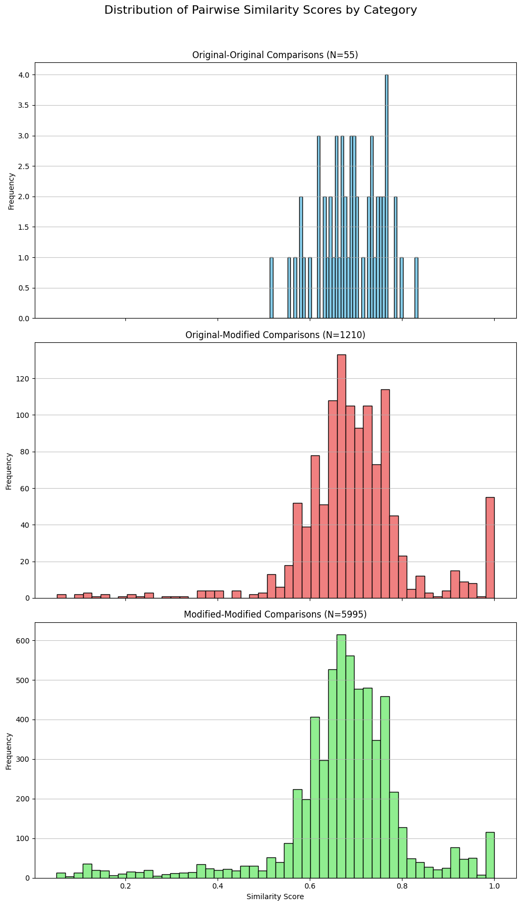

# Near-Duplicate Detection: Comprehensive Failure & Technical Analysis

This report provides a deep technical analysis of image deduplication methodologies, contrasting **State-of-the-Art Deep Learning Models** (ResNet50, DINOv2, CLIP) against **Perceptual Hashing Algorithms** (pHash, wHash).

---

# Section A: Model Failure Analysis (Subdirectories)
The subdirectories contain "Edge Cases" that expose the architectural biases of modern Computer Vision models.

## 1. The Invariance Paradox (`car_flip`)
**Scenario**: Horizontal Flip of the same source image.

| Reference | Variant (Flipped) |
| :---: | :---: |
|  |  |

### Model Analysis
1.  **CLIP**: **FAIL**. The text description "A photo of a yellow car" perfectly matches both images. The semantic embedding is identical because the "meaning" hasn't changed.
2.  **DINOv2**: **FAIL**. Trained with Self-Supervised Learning (SSL) using data augmentation (random flips). It is explicitly trained to produce the same embedding for a flipped image.
3.  **ResNet50**: **FAIL**. Uses **Global Max Pooling**. The feature map for "Wheel" activates regardless of whether it's on the left or right side of the image.

### Suggested Technique
*   **Perceptual Hashing (pHash)**: Use DCT-based hashing which preserves low-frequency spatial arrangement. A flip changes the frequency spectrum, resulting in a distinct hash.
*   **Geometric Verification**: Use Local Feature Matching (SIFT/ORB) with geometric consistency checks to detect the transformation matrix.

---

## 2. The Semantic Gap (`desc_mismatch`)
**Scenario**: Different content/text, same layout/palette.

| Image A | Image B |
| :---: | :---: |
|  |  |

### Model Analysis
1.  **CLIP**: **FAIL**. Both images map to the concept "Dark mode softare with text". CLIP is not an OCR engine; it aligns visual concepts to text. Since the concept is identical, the embeddings collapse to the same point.
2.  **DINOv2**: **FAIL**. DINO focuses on the "Global Layout" and "Texture". Since the layout (text box shape) and texture (grey background) are identical, it sees them as the same object class.
3.  **ResNet50**: **FAIL**. Deep CNNs are skewed towards **Texture Bias** rather than Shape Bias. The dominant texture (background noise) overwhelms the fine-grained shape differences of the letters.

### Suggested Technique
*   **Wavelet Hashing (wHash)**: Operates in the frequency domain using Haar Wavelets. It is highly sensitive to "Edges" (text lines). Since the text is different, the edge frequencies differ.
*   **OCR (Optical Character Recognition)**: Extract the actual text and compare the strings using Levenshtein Distance.

---

## 3. The Precision Threshold (`box_problem`)
**Scenario**: Bounding Box Jitter (Region Proposal Noise).

| Box A | Box B |
| :---: | :---: |
|  |  |

### Model Analysis
1.  **CLIP**: **FAIL**. The semantic semantic content is identical. CLIP has no notion of "Coordinates" or "Pixels".
2.  **DINOv2**: **FAIL**. The patch embeddings will be nearly identical because the visual content within the crops is 99% the same.

### Suggested Technique
*   **IoU (Intersection over Union)**: Calculate the overlap between the two boxes. If IoU > 0.95, merge them.
*   **Perceptual Hashing (pHash)**: returns a difference of **0** for these images, confirming they are visually duplicate enough to be merged.

---

# Section B: Hash & Histogram Validation (Root Images)
This section validates the algorithms using the control set.

## Validation Data
| Reference Image | Target Image | Control Image | Analysis Graph |
| :---: | :---: | :---: | :---: |
|  |  |  |  |

## Technical Validation

### 1. The "Zero Diff" Baseline
**Test**: `hash_test_person` vs `hist_test_person`.
*   **Observation**:
    *   **pHash**: `0`
    *   **wHash**: `0`
    *   **Histogram**: `1.000`
*   **Conclusion**: The system produces **Deterministic Results**. Identical inputs yield identical hashes.

### 2. The Histogram Failure Case (False Positive)
**Test**: `hash_test_person` (Person) vs `hash_test_dice` (Dice).
*   **Observation**:
    *   **Histsogram Correlation**: **0.9987**.
*   **The Problem**:
    *   Both images consist of ~90% white background pixels.
    *   The histogram bin for "White" (Value=255) is full for both.
    *   Mathematically, the correlation is dominated by the background, making the distinct foreground objects (Person vs Dice) statistically insignificant.
*   **The Solution**:
    *   **pHash Diff**: **34**.
    *   **Mechanism**: pHash analyzes **Structure** (frequencies), not just **counts**. The frequency spectrum of a "Dice" (sharp edges, dots) is radically different from a "Person" (curves, shading), regardless of the white background.
