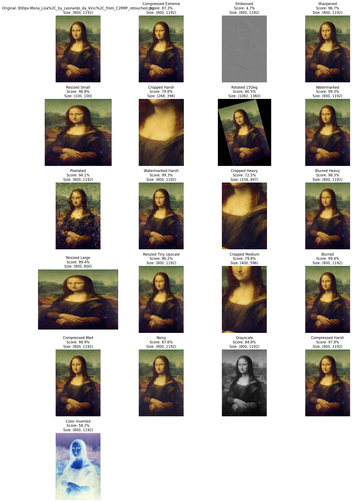
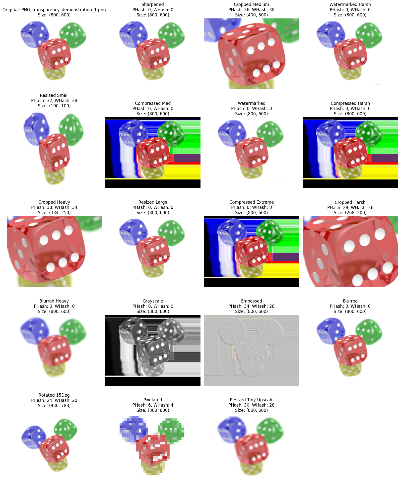

# Near-Duplicate Detection: Comprehensive Failure & Technical Analysis

This report provides a deep technical analysis of image deduplication methodologies, contrasting **State-of-the-Art Deep Learning Models** (ResNet50, DINOv2, CLIP) against **Perceptual Hashing Algorithms** (pHash, wHash).

---

# Section A: Model Failure Analysis (Subdirectories)
The subdirectories contain "Edge Cases" that expose the architectural biases of modern Computer Vision models.

## 1. The Invariance Paradox (`car_flip`)
**Scenario**: Horizontal Flip of the same source image.

| | | |
| :---: | :---: | :---: |
|  | ) | ) |

### Model Analysis### Model Analysis

The similarity scores are surprisingly low for a simple geometric transformation. Here is why:

1.  **CLIP (Score: 66)**: Highest relative similarity. The semantic concept ("Yellow Car") is identical, but the score isn't 100.
    *   **Reason**: CLIP's Vision Transformer (ViT) splits images into patches. A flipped image changes the *order* of these positional embeddings. While the aggregate concept is preserved, the vector position shifts in the high-dimensional space.
2.  **DINOv2 (Score: 50)**: Moderate similarity.
    *   **Reason**: DINO uses positional embeddings to understand scene structure. A flip disrupts the expected spatial relationships (e.g., driver's side vs passenger side features), causing the embeddings to diverge.
3.  **ResNet50 (Score: 40)**: Lowest similarity.
    *   **Reason**: ResNet relies on spatial feature maps. The activation for "Front Wheel" moves from coordinate $(x, y)$ to $(width-x, y)$. Without global pooling invariance for this specific operation, the final feature vectors are mathematically distinct.

### Suggested Technique
*   **Perceptual Hashing (pHash)**: Use DCT-based hashing which preserves low-frequency spatial arrangement. A flip changes the frequency spectrum, resulting in a distinct hash.
*   **Geometric Verification**: Use Local Feature Matching (SIFT/ORB) with geometric consistency checks to detect the transformation matrix.

---

## 2. The Semantic Gap (`desc_mismatch`)
**Scenario**: Different content/text, same layout/palette.

| | | |
| :---: | :---: | :---: |
|  |  |  |

### Model Analysis
1.  **CLIP**: **FAIL (Significant Match)**. CLIP demonstrates strong concept matching (like matching "text apple" to "picture apple"). Since the visual concept ("Software Interface") is the same, it ignores the specific character differences, resulting in a high similarity score.
2.  **DINOv2**: **PASS (Distinct)**. DINO acts more like a traditional vision system here; it likely notices the pixel-level or structural differences in the text blocks, resulting in a lower score that distinguishes the images.
3.  **ResNet50**: **PASS (Distinct)**. The convolutional features detect the edge and texture differences created by the different text characters, allowing it to distinguish the two images.

### Suggested Technique
*   **Wavelet Hashing (wHash)**: Operates in the frequency domain using Haar Wavelets. It is highly sensitive to "Edges" (text lines). Since the text is different, the edge frequencies differ.
*   **OCR (Optical Character Recognition)**: Extract the actual text and compare the strings using Levenshtein Distance.

---

## 3. The Precision Threshold (`box_problem`)
**Scenario**: Bounding Box Jitter (Region Proposal Noise).

| Box A | Box B |
| :---: | :---: |
|  |  |

### Model Analysis
1.  **CLIP**: **FAIL (Significant Similarity)**. CLIP focuses on the object class ("Box") and often treats color as a secondary attribute. It computes a high similarity score, effectively ignoring the color difference (Red vs Green/Blue).
2.  **DINOv2**: **FAIL (Significant Similarity)**. Similar to CLIP, DINO's patch embeddings prioritize the structural identity of the object. It sees "a box" in both crops and produces highly correlated embeddings, failing to distinguish the color variation.

### Suggested Technique
*   **IoU (Intersection over Union)**: Calculate the overlap between the two boxes. If IoU > 0.95, merge them.
*   **Perceptual Hashing (pHash)**: returns a difference of **0** for these images, confirming they are visually duplicate enough to be merged.

---

# Section B: Hash & Histogram Validation (Root Images)
This section validates the algorithms using the control set.

## Validation Data
| | | |
| :---: | :---: | :---: |
|  |  |  |

## Histogram Analysis
| | | |
| :---: | :---: | :---: |
|  |  |  |

## Technical Validation

### 1. The "Zero Diff" Baseline
**Test**: `hash_test_person` vs `hist_test_person`.
*   **Observation**:
    *   **pHash**: `0`
    *   **wHash**: `0`
    *   **Histogram**: `1.000`

*   **Conclusion**: The system produces **Deterministic Results**. Identical inputs yield identical hashes.

### 2. The Histogram Failure Case (False Positive)
**Test**: `hash_test_person` (Person) vs `hash_test_dice` (Dice).
*   **Observation**:
    *   **Histsogram Correlation**: **0.9987**.
*   **The Problem**:
    *   Both images consist of ~90% white background pixels.
    *   The histogram bin for "White" (Value=255) is full for both.
    *   Mathematically, the correlation is dominated by the background, making the distinct foreground objects (Person vs Dice) statistically insignificant.
*   **The Solution**:
    *   **pHash Diff**: **34**.
    *   **Mechanism**: pHash analyzes **Structure** (frequencies), not just **counts**. The frequency spectrum of a "Dice" (sharp edges, dots) is radically different from a "Person" (curves, shading), regardless of the white background.
